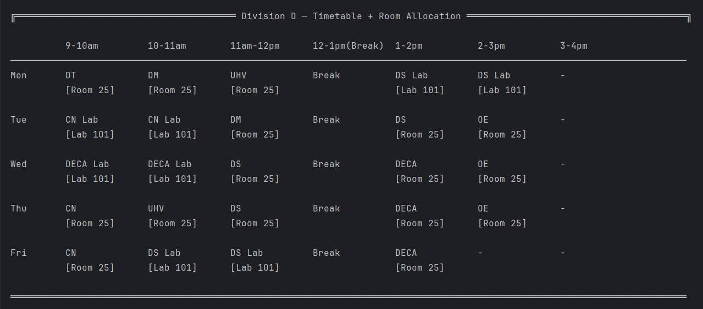
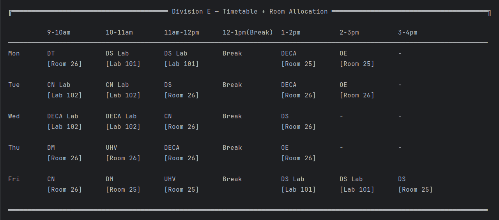

# Smart Timetable Generator

A constraint-based academic timetable scheduling engine developed in Java using **Backtracking**, **Most Constrained Variable (MCV) Heuristic**, and **Forward Checking**.

The system automatically generates optimized weekly timetables while satisfying faculty workload requirements, subject constraints, laboratory scheduling rules, and shared resource limitations.

---

## Problem Statement

Creating academic timetables manually is time-consuming and error-prone due to multiple scheduling constraints such as:

- Faculty workload limits
- Laboratory sessions requiring consecutive slots
- Subject distribution across the week
- Shared laboratory availability
- Avoiding timetable conflicts
- Efficient utilization of available time slots

This project automates the scheduling process using constraint satisfaction techniques and search-based optimization. The timetable generation process is modeled as a Constraint Satisfaction Problem (CSP), where subjects, faculty, time slots, and laboratory resources must satisfy a set of hard and soft constraints.

---

## Features

- Automated timetable generation for multiple divisions
- Constraint-based scheduling with break, faculty, subject, and laboratory rules
- Dynamic classroom and laboratory allocation
- Cross-division faculty conflict detection
- Shared room occupancy tracking
- Faculty workload management and summary generation
- Compact timetable generation with balanced workload distribution
- Forward checking and MCV-based search optimization
- Combined timetable and room allocation display
  
---

## Scheduling Architecture

```text
┌─────────────────────┐
│     Input JSON      │
└──────────┬──────────┘
           │
           ▼
┌─────────────────────┐
│    Input Loader     │
└──────────┬──────────┘
           │
           ▼
┌─────────────────────┐
│ Subject / Faculty   │
│      Models         │
└──────────┬──────────┘
           │
           ▼
┌─────────────────────┐
│ Session Expansion   │
│ (credits → sessions)│
└──────────┬──────────┘
           │
           ▼
┌─────────────────────┐
│    MCV Ordering     │
└──────────┬──────────┘
           │
           ▼
┌─────────────────────┐
│ Backtracking Search │
└──────────┬──────────┘
           │
           ▼
┌─────────────────────┐
│ Constraint Checks   │
│ + Forward Checking  │
└──────────┬──────────┘
           │
           ▼
┌─────────────────────┐
│ Resource Validation │
│ • Faculty Conflicts │
│ • Room Conflicts    │
└──────────┬──────────┘
           │
           ▼
┌─────────────────────┐
│   Room Allocation   │
└──────────┬──────────┘
           │
           ▼
┌─────────────────────┐
│ Final Timetable &   │
│ Faculty Summary     │
└─────────────────────┘
```

The scheduler expands weekly credits into individual sessions, orders them using the **Most Constrained Variable (MCV)** heuristic, and assigns them through **backtracking search**. At each step, **forward checking**, **faculty availability validation**, and **room allocation constraints** are applied to ensure a valid and conflict-free timetable.

---

## Algorithms Used

| Algorithm / Heuristic | Purpose |
|----------|---------|
| Backtracking | Explores valid timetable configurations |
| Most Constrained Variable (MCV) | Schedules harder subjects first |
| Forward Checking | Prunes infeasible branches early |
| Load Balancing | Distributes sessions across the week |
| Compact Slot Placement | Minimizes timetable gaps |
| Lab Distribution | Avoids clustering laboratory sessions |

---

## CSP Formulation

The timetable generation problem is modeled as a Constraint Satisfaction Problem (CSP).

| Component | Representation |
|------------|---------------|
| Variables | Teaching sessions |
| Domains | Available day-slot-room combinations |
| Constraints | Faculty, room, lab, workload, and scheduling rules |

The scheduler uses Backtracking, MCV, and Forward Checking to efficiently search for valid solutions.

---

## Scheduling Constraints

### Hard Constraints

- No scheduling during break periods
- No duplicate subject on the same day
- Faculty workload limits must be respected
- Labs require consecutive slots
- Rooms cannot be double-booked
- Faculty cannot teach multiple divisions simultaneously
- Lab sessions must use lab rooms
- Every session requires a valid room allocation

### Soft Constraints

- Balance workload across days
- Minimize timetable gaps
- Spread laboratory sessions across the week

---


## Project Structure

```text
SmartTimetableGenerator
│
├── ByteKnights.java
├── input.json
│
├── Subject
├── Faculty
├── InputLoader
├── DivisionScheduler
│
└── Output
```

---

## Input Format

Example:

```json
{
  "classroom": "25",
  "divisions": ["D", "E"],

  "subjects": [
    {
      "code": "23PCIT301",
      "name": "DS",
      "sessionType": "L",
      "creditsPerWeek": 3
    }
  ],

  "faculty": [
    {
      "name": "Mrs. Kulkarni",
      "subject": "23PCIT301",
      "division": "D"
    }
  ]
}
```

---

## Sample Output

### Timetable + Room Allocation




### Faculty Summary


---

## Complexity Analysis

Let:
- S = Number of sessions
- D = Number of days
- T = Number of available slots per day

### Worst Case

O((D × T)^S)
The scheduling problem is a Constraint Satisfaction Problem (CSP) and is NP-hard in the general case.

### Optimizations Used

To reduce practical runtime:

- Most Constrained Variable (MCV)
- Forward Checking
- Day Load Heuristics
- Compact Slot Selection
- Early Constraint Pruning

---

## Technologies Used

- Java
- JSON (org.json)
- Backtracking Algorithms
- Constraint Satisfaction Techniques (CSP)
- Heuristic Search
- Scheduling Optimization
- Resource Allocation
- Constraint Propagation


---

## Major Enhancements

- Multi-division scheduling
- Forward checking
- MCV heuristic
- Cross-division faculty conflict handling
- Dynamic room allocation
- Shared resource tracking
- Compact timetable generation

---

## Future Enhancements

- Room capacity constraints
- Faculty preference-based scheduling
- Graph-coloring based scheduling model
- Timetable quality scoring metrics
- PDF/Excel export
- Interactive GUI using JavaFX

---

## Achievement

Developed as part of a Loop-CCOEW's Buffer 6.0 - DSA Project Competition in the Next-Gen Academic Solutions domain and secured **3rd Place**.
