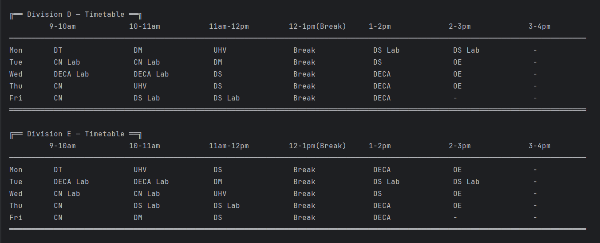
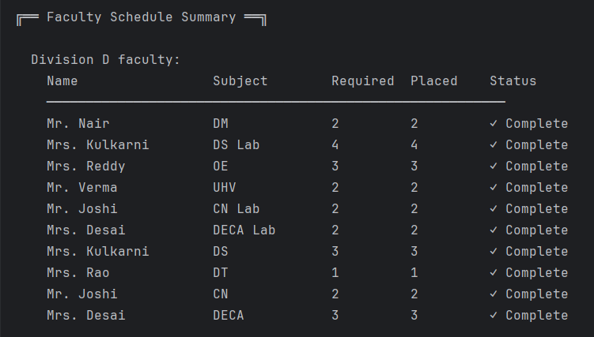
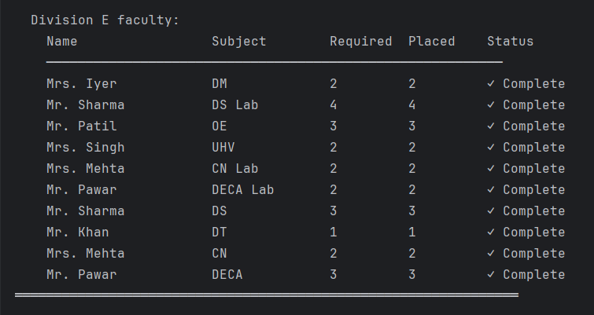

# Smart Timetable Generator

A constraint-based academic timetable scheduling system developed in Java using **Backtracking**, **Most Constrained Variable (MCV) Heuristic**, and **Forward Checking**.

The system automatically generates optimized weekly timetables while satisfying faculty workload requirements, subject constraints, laboratory scheduling rules, and shared resource limitations.

---

## Problem Statement

Creating academic timetables manually is time-consuming and error-prone due to multiple scheduling constraints such as:

- Faculty workload limits
- Laboratory sessions requiring consecutive slots
- Subject distribution across the week
- Shared laboratory availability
- Avoiding timetable conflicts
- Efficient utilization of available time slots

This project automates the scheduling process using constraint satisfaction techniques and search-based optimization.

---

## Features

### Automated Timetable Generation
- Generates complete weekly timetables automatically.
- Supports multiple divisions.

### Constraint-Based Scheduling
- No scheduling during break periods.
- Prevents duplicate occurrence of a subject on the same day.
- Ensures faculty workload requirements are satisfied.
- Handles laboratory sessions occupying consecutive slots.

### Optimization Heuristics
- Backtracking search.
- Most Constrained Variable (MCV) heuristic.
- Forward checking for early dead-end detection.
- Load-balanced day selection.
- Compact timetable generation.

### Shared Resource Management
- Shared laboratory occupancy tracking.
- Prevents simultaneous allocation of the same lab resource.

### Faculty Tracking
- Tracks required and scheduled teaching load.
- Generates faculty-wise scheduling summary.

---

## Algorithms Used

### 1. Backtracking

The scheduler incrementally assigns sessions to timetable slots.

If a placement violates any constraint, the algorithm backtracks and tries an alternative placement.

### 2. Most Constrained Variable (MCV)

Subjects are scheduled in an order that reduces the search space and improves convergence.

### 3. Forward Checking

After every placement, the scheduler verifies that all remaining sessions still have valid placement possibilities.

Branches that cannot lead to a valid solution are pruned immediately.

### 4. Load Balancing Heuristic

Days with lower current occupancy are prioritized to achieve a more balanced timetable.

### 5. Lab Distribution Heuristic

Laboratory sessions are spread across the week to avoid clustering.

---

## Scheduling Constraints

### Hard Constraints

- Break slot cannot be used.
- Faculty workload must not exceed assigned quota.
- A subject cannot be scheduled more than once on the same day.
- Laboratory sessions must occupy two consecutive slots.
- Shared laboratory resources cannot be double-booked.

### Soft Constraints

- Prefer less-loaded days.
- Prefer compact timetables.
- Distribute labs across different days whenever possible.

---

## Project Structure

```text
SmartTimetableGenerator
│
├── ByteKnights.java
├── input.json
│
├── Subject
├── Faculty
├── InputLoader
├── DivisionScheduler
│
└── Output
```

---

## Input Format

Example:

```json
{
  "classroom": "25",
  "divisions": ["D", "E"],

  "subjects": [
    {
      "code": "23PCIT301",
      "name": "DS",
      "sessionType": "L",
      "creditsPerWeek": 3
    }
  ],

  "faculty": [
    {
      "name": "Mrs. Kulkarni",
      "subject": "23PCIT301",
      "division": "D"
    }
  ]
}
```

---

## Sample Output

### Generated Timetable



### Faculty Summary




---

## System Architecture

```text
Input JSON
     │
     ▼
Input Loader
     │
     ▼
Subject & Faculty Models
     │
     ▼
Session Expansion
     │
     ▼
Backtracking Engine
     │
     ▼
Forward Checking
     │
     ▼
Constraint Validation
     │
     ▼
Timetable Generation
     │
     ▼
Faculty Summary
```
---

## Complexity Analysis

Let:

- S = Number of sessions
- D = Number of days
- T = Number of available slots per day

### Worst Case

```text
O((D × T)^S)
```

The scheduling problem is a Constraint Satisfaction Problem (CSP) and is NP-hard in the general case.

### Optimizations Used

To reduce practical runtime:

- Most Constrained Variable (MCV)
- Forward Checking
- Day Load Heuristics
- Compact Slot Selection
- Early Constraint Pruning

---

## Future Enhancements

- Faculty conflict handling across divisions
- Classroom allocation and room capacities
- Graph-coloring based scheduling model
- Timetable quality metrics
- PDF/Excel timetable export
- Interactive GUI using JavaFX

---

## Technologies Used

- Java
- JSON (org.json)
- Backtracking Algorithms
- Constraint Satisfaction Techniques
- Heuristic Search

---

## Key Learning Outcomes

- Constraint Satisfaction Problems (CSP)
- Recursive Backtracking
- Search Space Optimization
- Forward Checking
- Heuristic-Based Scheduling
- Resource Allocation Systems

---

## Achievement

Developed as part of a Loop-CCOEW's Buffer 6.0 - DSA Project Competition in the Next-Gen Academic Solutions domain and secured **3rd Place**.
